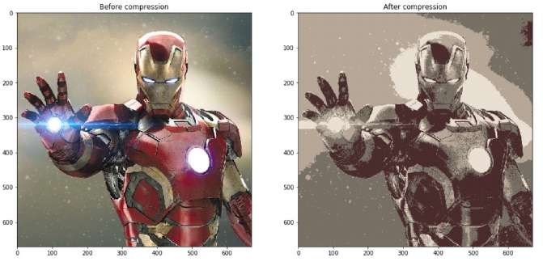
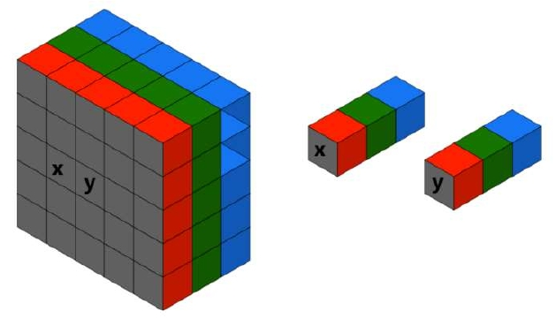

# Description
This project was designed by [Prof. Zohreh Azimifar](https://scholar.google.com/citations?user=tW63cfUAAAAJ&hl=en) 
for the Discrete Mathematics course (Fall 2021)

## Overview
As you have seen, we can define a function from one set to another and
sometimes functions are called mappings. Clustering is the process of dividing data into
multiple clusters, each of which consists of one or more similar data. In fact, clustering
maps the given data to a set of clusters each represented by a centroid. The clustering
algorithm requires the greatest similarity between the data of the same cluster, while the
data of different clusters has the smallest similarity between the clusters. The K-means
algorithm solves the clustering problem of data in multidimensional space. Since the
distance between data in the same cluster should be smaller than the distance with the
data outside the cluster, which can be considered the center of the Kth cluster, also known
as the centroid. The goal of the K-means algorithm is to find such a group, assign each data
to the cluster with the centroid closest to itself, and find minimum accumulation distances
of each data point with the cluster center.

## Image Compression
The K-means algorithm can be used to compress the image by mapping a large set of pixel
colors to a smaller subset of pixel colors. Unlike lossless compression, K-means uses lossy
compression, so it is not possible to recover the original image from the compressed
image. The larger the compression ratio, the larger the difference between the compressed
image and the original image.  



# Phases
 **1.Methodology**  
 In this phase, we are going to explain how K-Means algorithm works. In fact, K-Means is a 
   clustering algorithm which is mostly used in machine learning area.
   An image is made up of several intensity values known as Pixels (RGB values). See the picture
   below to understand the concept better:  

  

   K-means clustering will group similar colors together into ‘k’ clusters (say k=3) of different colors.
   Using K-Means, we’ll introduce ‘k’ centroids randomly. Then, we should assign each element of
   our data to a centroid like a graph and update these elements until we reach a limitation we’ve
   set before or there isn’t much difference between the last update and the data we have right now.
   To understand the algorithm better, let’s take a look at an example which is trying to group our
   data into 3 clusters.  


   As we see in the picture, First, we choose 2 centroids randomly. Then, we should calculate the
   distance between the centroids and each element to determine how to connect the elements to
   their relative centroids. Note that this distance can be calculated using several methods. For
   example, we can use Euclidean distance. We’ll do this operation until our data is clustered
   correctly.  
   extra information about choosing the best result:  

   _Best result for a given K_: In order to have the best result, we’ll do the process for
   different values of centroids and choose the one with the least summation of variances
   per cluster. This method gives us the best result but keep in mind that it will take more
   time to execute.

**2.Implementation**  
In the second phase, we have implemented a program with Python to compress an image using
K-Means algorithm. We’ll have a brief explanation of how our program works introducing some
of the most important function that have been used in the program. Also, we’ve provided a text
file at the end of execution which gives us some more details about the process such as
execution time, centroid changes, etc.
 * Calculating distance  
```
def distance(pixel, pixel_tar, n=2):
    under_root = 0
    for i in range(2, 5):
        under_root += (abs(int(pixel_tar[i]) - int(pixel[i]))) ** n
    return under_root ** (1 / n)
```
In this function we’re using Euclidean distance method but be aware that other methods
can also be used.
 * Finding the closest centroid to each element  
```
def findClosestCentroid(centroids, point, n=2):
    global pixel_changes
    return_val = 0
    distance_val = distance(point, centroids[0], n)
    for i in range(len(centroids)):
        if distance(point, centroids[i], n) < distance_val:
            pixel_changes += 1
            return_val = i
    return return_val
```
We’ll use the distance function we’ve written before to calculate the distance from each
centroid. At the end we will choose the centroid with least distance.
 * Updating centroids  
```
def updateCentroid(centroidElements, centroid):
    summation = [-1, -1, 0, 0, 0]
    n = len(centroidElements)
    if n == 0:
        return centroid
    for centroidElement in centroidElements:
        for i in range(2, 5):
            summation[i] += centroidElement[i]
    return [-1, -1, summation[2] // n, summation[3] // n, summation[4] // n]
```
These functions were used to implement the main process of compressing our picture. Also, we
used a creative solution in the last part of our program to avoid searching for elements of a graph
to replace its value with the value of centroid and to improve performance.
We used a 5-element array instead of a 3-element array to save the position of each pixel while
connecting them with their centroids. So, at the we can replace the values with only a single for
loop.

**3.Application**  
In the third phase, we’ll show one of the outputs of our program and its effect on both number
of colors used in the picture and decreasing the size of picture.  
 * Original image (Size = 1.34MB):


 * Compressed image (k = 3, Size = 213KB):


 * Original image alongside with the compressed one (original, k = 20, k = 4):


